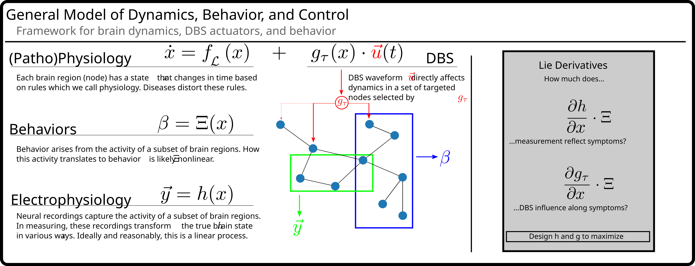

# AutoDyn

## Overview
A Python library for dynamical systems $\pm$ control theoretic analyse.
Focused on generating dynamical systems that can be directly measured + simulated + analysed.
Extended to include simple controllability analyses, and generative model generation.

### Motivation
At the time I started this there weren't any available libraries that would be able to interact with the whole-brain models I fit to empirical data (DBS for Depression work).
While working with the group at The Virtual Brain (TVB) I found a need to assess DBS ability to control behavior through the brain state/dynamics.
This work was an effort to build a library, from scratch.

Since starting this there has been great progress in nonlinear controllability analyses, but the hope is that this library is an easy-to-use drop in for toy-models of the brain.
Many of the models that clinicians use in their day-to-day job can easily be collapsed into simple toy-models and this library is meant to analyse those toy-models.
Other libraries would be more appropriate for efforts to model massive whole-brain networks derived from massive datasets.

This library started as a way to build fully-differentiable *neural* mass models using numpy functions.
From there, it expanded to generalized dynamical systems with the goal of applying Lie Controllability Analyses and Feedback Linearization.

In 2024, amidst the generative AI hype-cycle, I came up with the idea of generating random dynamical systems, performing a stability analysis of them, and then using Transformers/SSM to build a model that can generative arbitrary dynamical systems with certain properties.
This is still a WIP, but let's see if we can do it - it'll be fun and useful to build that out for both teaching and for spot-projects in CT using toy models.

## Dynamics

## Controls

## What is Lie Controllability
Lie controllability (LC) is the nonlinear version of controllability analyses.
More broadly, controllability analysis directly studies how systems behave and how our interventions change how systems behave.
This give us a powerful way to optimize our inteventions directly and rationally - an alternative to grid searching through a potentially vast parameter space.

In LC we can directly observe the interactions that our controller has on the dynamics of the system, and then use these interactions to design controllers with desired properties.

---

All images and text are licensed under Creative Commons CC-BY License (https://creativecommons.org/licenses/by/4.0/legalcode)

By Vineet Tiruvadi (vineet.tiruvadi@gmail.com, vineet@tiruvadi.net)
